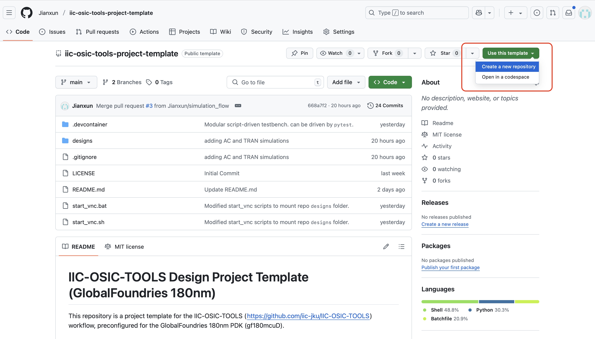
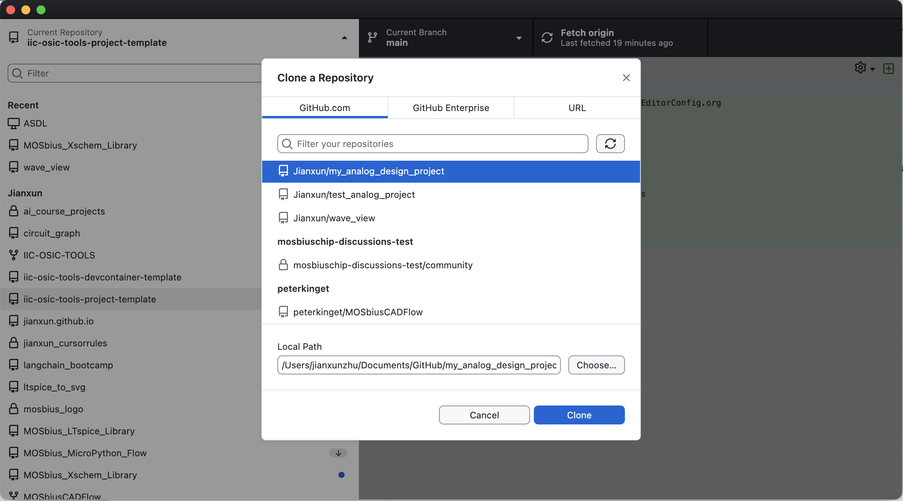
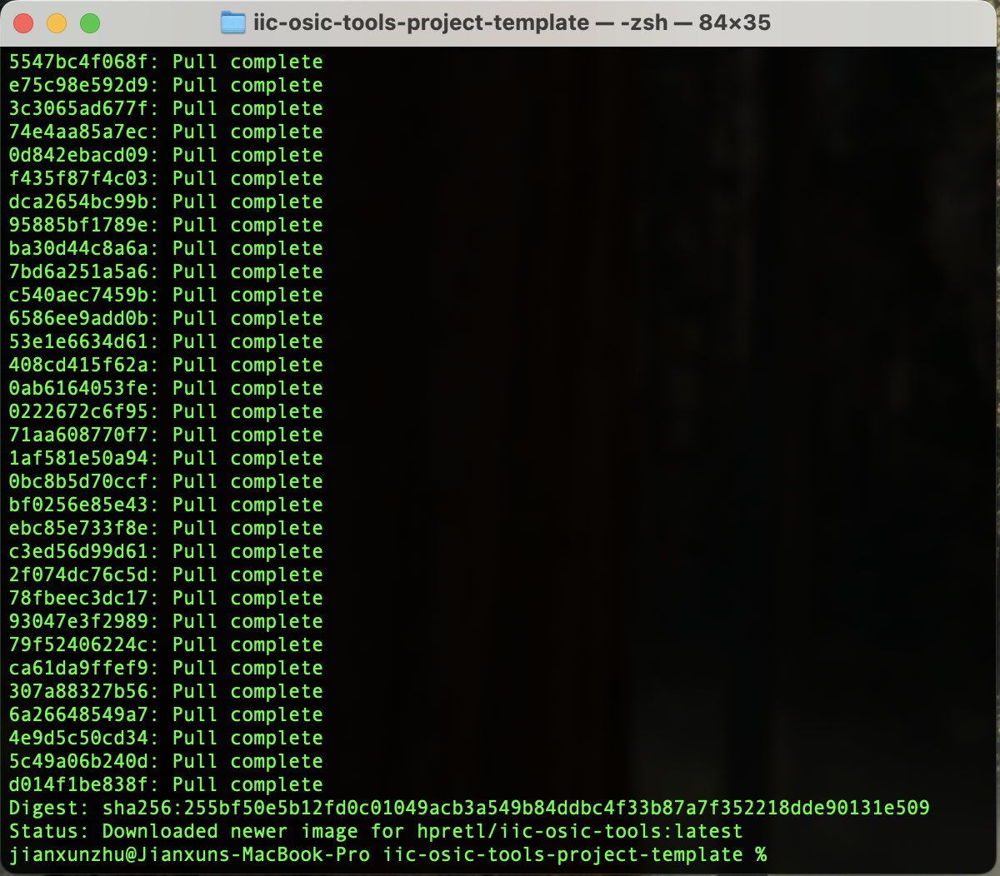
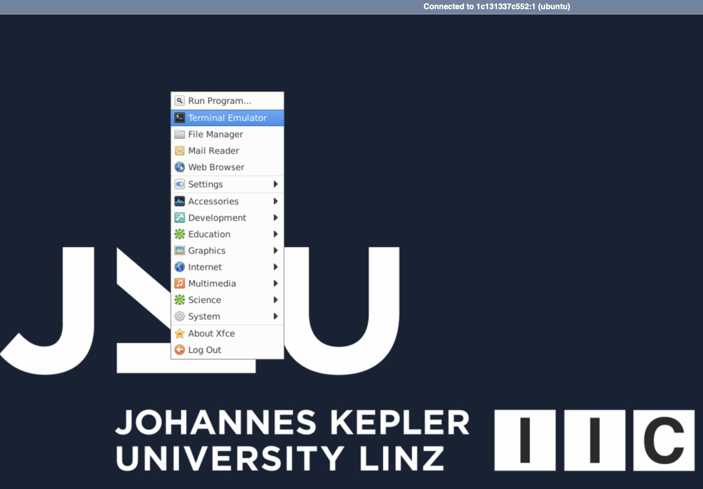

# Spikcore

The Spikcore team has the goal to design a reconfigurable neuromorphic chip, this neuromorphic chip can be used to test codification schemes, control strategies and learn about analogic circuits

The  previously proven MOSbius platform shows the possibility to reconfigure the internal components of the chip; thus achieving different applications with the same hardware


## Where's the proposal ?

the proposal presented at the SSCS 2025 on july 11th can be found [here](https://github.com/RoyceRichmond/Mosbious_2025_spiking4all/blob/main/proposal/%5BChipathon%202025%205th%20Weekly%201_2%20-%20TC%20OSE%2011%20July%202025%5D.pdf)

The full proposal of the team can be found [here](https://github.com/RoyceRichmond/Mosbious_2025_spiking4all/blob/main/proposal/Chipathon%202025.pdf)


## Getting Started

### Step 1: Create Your Project Repository

#### Use GitHub Template

This repository is set up as a GitHub template. Using the template feature gives you a clean project without the template's commit history.

1. Visit the template repository: [https://github.com/Jianxun/iic-osic-tools-project-template/](https://github.com/Jianxun/iic-osic-tools-project-template/)
2. Click the green **"Use this template"** button
3. Select **"Create a new repository"**
4. Fill in your repository details:
   - Repository name (e.g., `my-analog-design-project`)
   - Description (optional)
   - Choose public or private
5. Click **"Create repository"**



**Clone your new repository using GitHub Desktop:**
1. Open GitHub Desktop
2. Click "Clone a repository from the Internet"
3. Select your newly created repository
4. Choose your local directory and click "Clone"



### Step 2: Launch the Docker Container

The project includes platform-specific scripts to launch the Docker container with the IIC-OSIC-TOOLS environment. Before running the following scripts, make sure your Docker Desktop is running.

#### For Mac/Unix/Linux Systems:
Open a terminal, navigate to you repository, and use the following command:
```bash
./start_chipathon_vnc.sh
```

#### For Windows Systems:

**Open Command Prompt or PowerShell** navigate to you repository, and use the following command:


```cmd
.\start_chipathon_vnc.bat
```
If you are familiar with git bash, feel free to use `start_chipathon_vnc.sh`.

This will take a while to pull the latest IIC-OSIC-TOOLS image. Have a coffee.



### Step 3: Access the Design Environment

Once the container is running, you have two options to access the design environment:

#### Option A: VNC Client (Recommended for better performance)
1. Download a VNC client:
   - **Windows**: [TigerVNC](https://tigervnc.org) 
   - **macOS**: [TigerVNC](https://tigervnc.org)  or built-in Screen Sharing
   - **Linux**: `vncviewer` (install via package manager)

2. Connect to: `localhost:5901`
3. Enter password: `abc123`


#### Option B: Web Browser (noVNC)
1. Open your web browser
2. Navigate to: `http://localhost`
3. Enter password: `abc123`
4. Click "Connect"


### Step 4: Open a Terminal

Once you're in the VNC session:
1. Right-click on the desktop
2. Select "Terminal Emulator" (or similar option)
3. You should automatically be in the `/foss/designs` directory



### Step 5: Project Directory Structure

The `/foss/designs` directory inside the Docker container is mounted from the `designs` folder in this repository.

**Important:** Keep all your design files within the `designs` folder to ensure they persist when the Docker container is restarted.

```
project-root/
├── designs/              # Your design files (mounted in container as /foss/designs)
│   ├── libs/            # Design libraries
│   ├── simulations/     # Simulation results
│   └── setup_pdk.sh     # PDK setup script
├── start_vnc.sh         # Container launch script (Unix/Linux/Mac)
├── start_vnc.bat        # Container launch script (Windows)
└── README.md            # This file
```

## Library Structure Conventions

The project follows specific naming conventions for organizing design libraries under `/designs/libs/`:

### Directory Structure
```
/designs/libs/
├── core_*/          # Design libraries (core functionality)
├── tb_*/            # Testbench libraries
└── ...
```

### Naming Conventions
- **`core_*`**: Design libraries containing your core circuit implementations
- **`tb_*`**: Testbench libraries containing simulation and verification setups

### File Organization
Within each library directory:
- Each cell should have its own subdirectory: `/designs/libs/library_name/cell_name/`
- Files within a cell directory should be prefixed with the cell name (e.g., `cell_name.sch`, `cell_name.sym`)
- **Exception**: Testbench directories (starting with `tb_`) are exempt from the file naming prefix requirement

### Validation
Use the provided sanity check script to validate your library structure:
```bash
cd designs/CI
./library_check.sh
```

This script verifies:
- Proper directory hierarchy (no files at inappropriate levels)
- Correct file naming conventions for design libraries
- Exempts testbench libraries from strict naming requirements


## Example Design: 5-Transistor Single Stage OTA

This project includes a reference design to demonstrate the library structure and design flow:

### Libraries
- **Design**: 5-Transistor Single Stage Operational Transconductance Amplifier (OTA)
- **Library Location**: `core_analog`
- **Testbench Location**: `tb_analog`


### Usage
1. **Design Files**: Navigate to `/designs/libs/core_analog/` to find the schematics and symbols of the OTA cell and parameterized unit transistor cells.
2. **Testbench**: Use the verification setups in `/designs/libs/tb_analog/` to simulate and characterize the design.
3. **Validation**: Run the library check to ensure proper file organization:
   ```bash
   cd designs/CI
   ./library_check.sh
   ```

This example demonstrates the proper use of the library naming conventions (`core_*` for design libraries, `tb_*` for testbenches) and serves as a starting point for developing your own analog circuits.