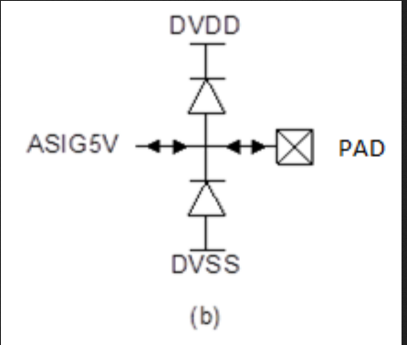
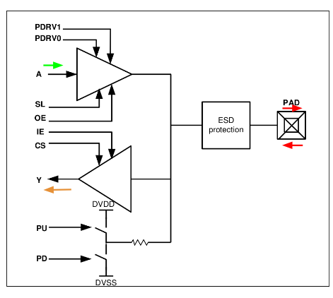

# Padframe integration

the Padframe is provided by the organizers but still need to be configured, this will be 

## Analog Signal I/O PAD

The 5.0V analogue signal pad is meant for analogue circuits that use the thick-gate transistors.

This pads have 8 finger of METAL2 named assign5v where the connections should be made. (they have protection diodes and capacitors )

## Digital I/O Tristate
The digital I/O can be configured as input, output or tristate, it depends on the bits (note that the port is actually two drivers one output and one input, on Input only I/O cells you will only find the lower part of the driver)

### Ports
| Port  | Description                         |
|-------|-------------------------------------|
| ----- | output Configuration                |
| PDRV0 | Output drive strength selector      |
| PDRV1 | Output drive strength selector      |
| A     | Data input from core                |
| SL    | Fast/Slow slew rate select          |
| OE    | Output enable                       |
| ----- | input Configuration                 |
| IE    | Input enable                        |
| CS    | CMOS/Schmitt trigger input select   |
| Y     | Data output to core                 |
| PU    | Pull-up enable                      |
| PD    | Pull-down enable                    |
| ----- | external PAD                        |
| PAD   | Data input from/output to bond pad  |

### Options

| CS | Input Type      |
|----|-----------------|
| 0  | CMOS Buffer     |
| 1  | Schmitt Trigger |

| SL | Output Slew Rate |
|----|------------------|
| 0  | Fast             |
| 1  | Slow             |

| IE | OE | Input Output Control     |
| -- | -- | ------------------------ |
| 0  | 0  | IO Disable               |
| 0  | 1  | Output Enabled           |
| 1  | 0  | Input Enabled            |
| 1  | 1  | Disallowed               |

| PU | PD | Resistive Pulling |
|----|----|-------------------|
| 0  | 0  | Normal CMOS       |
| 0  | 1  | Pull Down         |
| 1  | 0  | Pull Up           |
| 1  | 1  | Normal CMOS       |

| PDRV1 | PDRV0 | Output drive strength |
|-------|-------|-----------------------|
| 0     | 0     | 4mA                   |
| 0     | 1     | 8mA                   |
| 1     | 0     | 12mA                  |
| 1     | 1     | 16mA                  |


In our case for an input we can configure it like this 

IE=1, CS=1, PU=0, PD=0

Input Enabled, Schmitt Trigger, Normal CMOS (note that pull up or down can be used on inputs and it will make a change in the input easier, not a great idea with noisy signals)

The output driver is disabled and all the control bits set to zero

OE=0, SL=0, PDRV1=0, PDRV0=0
## Documentation

Documentation on the pads and config can be found [here](https://gf180mcu-pdk.readthedocs.io/en/latest/IPs/IO/gf180mcu_fd_io/digital.html)

Report on the padring on the [chipathon 2023](https://docs.google.com/presentation/d/1bg6gA1EwBESlcAxqpyheD7kwKJdteA6P6Jksey-j1Jw/edit?slide=id.p#slide=id.p)


## verification

| Table  | Description                         |
|--------|-------------------------------------|
| geom | GEOMETRY RULES      |

```
python3 run_drc.py --path=/foss/designs/Integration_padframe_2025_sscs/Padframe_submission/Chipathon2025_3_padring_integrated.gds --variant=D --run_dir=/foss/designs/tp/ --mp=8 --thr=12 --run_mode=tiling --no_connectivity --table=geom
```


